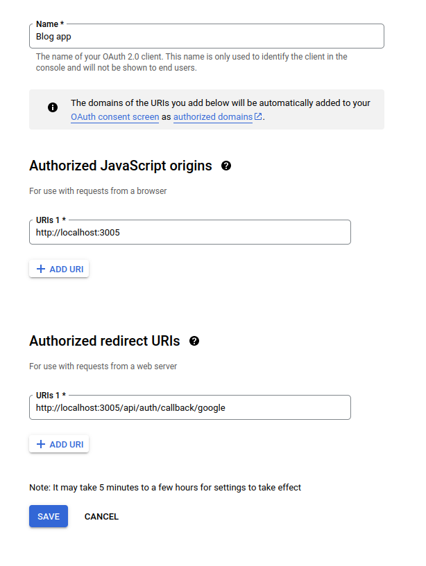

# Blog app

Created from [this](https://www.youtube.com/watch?v=DpYE5zPDRVQ) tutorial

# Setup

## MongoDB

It's required to have MongoDB.

## Auth

For the authentication steps it's required to have oauth credentials
On google console credentials page in create credentials select 'OAuth client ID'


Once created set this environment variables:
```bash
GOOGLE_ID=YOUR_ID
GOOGLE_SECRET=YOUR_SECRET

NEXT_AUTH_URL=localhost:3005
```

Unable to test authentication, because google changes 'http' to 'https' internally then it's not possible to do this.
Am I missing something?
<!-- https://localhost:3005/api/auth/callback/google -->

# Run

```bash
npm run dev
```
